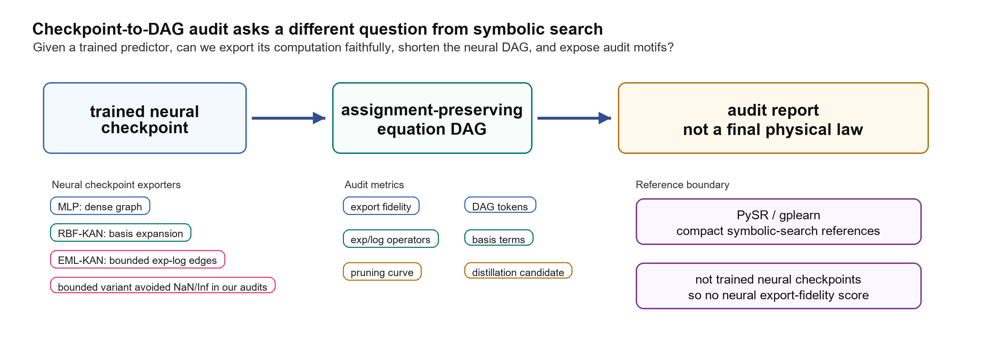
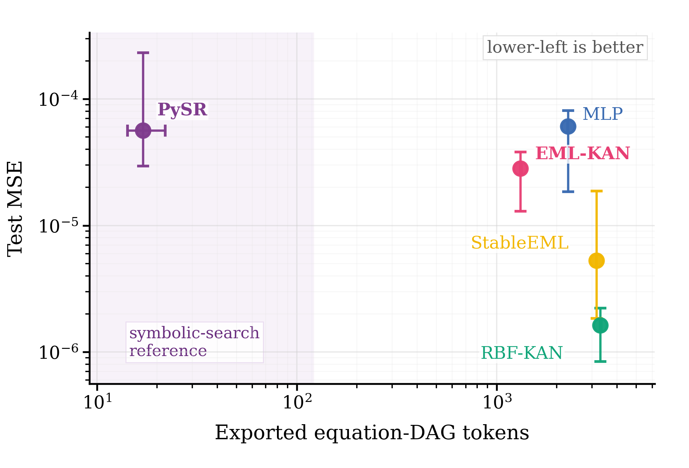
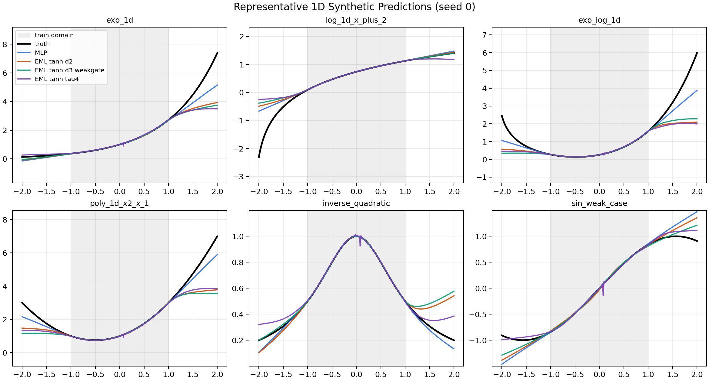
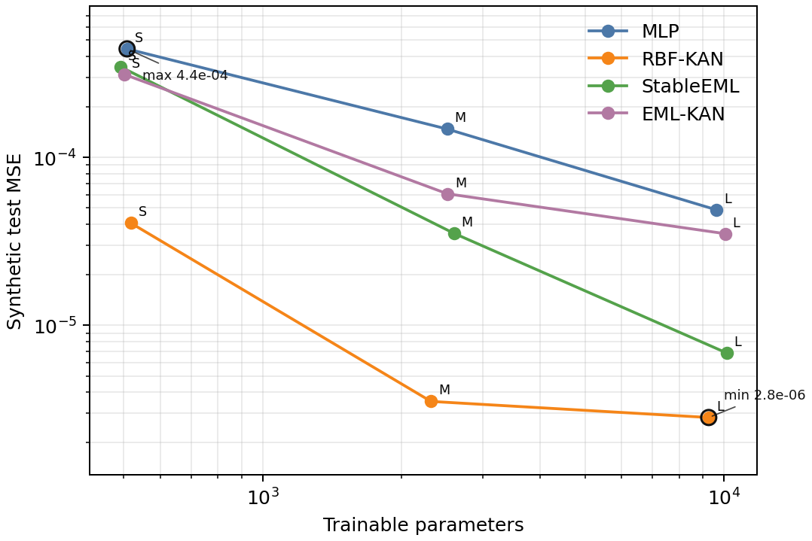

# Auditable Neural Equation DAG Export for Scientific Data Mining

[](https://www.python.org/)
[](https://pytorch.org/)
[](#project-status)
[](#license)

This repository is the research artifact for **Auditable Neural Equation DAG Export for Scientific Data Mining**. It studies a practical question that sits between neural prediction and symbolic regression:

> Given a trained neural predictor, can we export its computation as an equation DAG, audit that DAG faithfully, shorten it, and expose scientifically meaningful operator motifs?

The code trains neural baselines, exports their learned computation graphs, measures equation-DAG complexity and fidelity, and compares the resulting audit reports against compact symbolic-search references such as PySR and gplearn.

<p align="center">
  
</p>

## Why This Repository Exists

Scientific data mining often needs more than low prediction error. A useful model should also be inspectable: which operators did it use, how large is the exported computation, how faithful is the export to the checkpoint, and does pruning reveal a simpler candidate expression?

This project focuses on **checkpoint-to-DAG audit** rather than claiming that every exported expression is a final physical law. The exported DAG is treated as an auditable object:

- **Fidelity:** Does the exported equation reproduce the neural checkpoint predictions?
- **Compactness:** How many equation-DAG tokens and active terms are needed?
- **Operator structure:** How much of the graph is built from exp/log scientific operators?
- **Pruning behavior:** Which gates or terms can be removed with limited loss?
- **Reference boundary:** How does the audit compare with direct symbolic-search baselines?

## Core Contributions

| Component | What it does |
| --- | --- |
| **Stable exp-log edge operators** | Uses bounded exponential-logarithmic edge functions designed for stable formula-like modeling. |
| **EML-KAN checkpoint exporters** | Converts trained MLP, RBF-KAN, StableEML, and EML-KAN checkpoints into auditable equation DAGs. |
| **DAG-level audit metrics** | Reports token count, active edges, active terms, exp/log operator counts, fidelity, and pruning curves. |
| **Synthetic scientific benchmarks** | Includes generated exp/log, power-law, Arrhenius-like, saturation, and multiplicative-response tasks. |
| **External symbolic references** | Supports PySR and gplearn runs as compact symbolic-search reference points, not neural checkpoint exports. |
| **Paper table and figure builders** | Provides scripts that regenerate audit tables, breakdowns, sensitivity summaries, and figures. |

## Result Preview

The following images are lightweight copies of generated artifacts. Large raw logs, checkpoints, and datasets are intentionally excluded from Git.

<p align="center">
  
</p>

The audit separates predictive accuracy from exported graph complexity. Lower-left regions indicate compact formulas with lower test error, while neural checkpoint exporters and symbolic-search references are interpreted under different boundaries.

<p align="center">
  
</p>

Representative one-dimensional synthetic tasks show how neural models behave inside and outside the training domain.

<p align="center">
  
</p>

The repository includes scripts for Pareto-style budget comparisons across model families and parameter scales.

## Repository Layout

```text
.
|-- README.md
|-- requirements.txt
|-- requirements-optional.txt
|-- docs/
|   |-- assets/                         # README figures tracked in Git
|-- experiments/
|   |-- run_tabular.py                  # main tabular training loop and model definitions
|   `-- run_feynman.py                  # low-dimensional AI-Feynman experiment runner
|-- scripts/
|   |-- generate_equation_native.py     # synthetic equation dataset generator
|   |-- run_equation_audit.py           # train/export/audit neural equation DAGs
|   |-- run_external_symbolic_baselines.py
|   |-- run_pareto_synthetic.py
|   |-- plot_equation_paper_figures.py
|   `-- build_*.py                      # paper tables, review tables, and figure builders
|-- src/
|   `-- symbolic_export/
|       |-- graph_export.py             # DAG text export and graph statistics
|       |-- export_models.py            # SymPy-style model export helpers
|       `-- expression_metrics.py       # expression complexity and edit metrics
|-- tests/                              # unit tests for artifact/table builders
```

Ignored local directories include `data/`, `results/`, `results_v2/`, `logs/`, checkpoints, NumPy arrays, archives, and local dependency caches. This keeps the public repository small and reviewable.

## Installation

The project is pure Python around PyTorch, NumPy, pandas, SymPy, and plotting/table-building utilities.

### 1. Clone

```bash
git clone <anonymous-review-url>
cd Auditable-Neural-Equation-DAG-Export-for-Scientific-Data-Mining
```

### 2. Create an environment

Linux/macOS:

```bash
python -m venv .venv
source .venv/bin/activate
python -m pip install --upgrade pip
pip install -r requirements.txt
```

Windows PowerShell:

```powershell
python -m venv .venv
.\.venv\Scripts\Activate.ps1
python -m pip install --upgrade pip
pip install -r requirements.txt
```

For CUDA training, install the PyTorch build that matches your driver/CUDA version from the official PyTorch instructions, then install the remaining requirements.

Optional symbolic-search baselines:

```bash
pip install -r requirements-optional.txt
```

PySR also requires a working Julia runtime. The neural export pipeline can be run without PySR by passing `--skip-pysr`.

## Data

### Synthetic equation-native datasets

The main synthetic tasks are generated locally and are not stored in Git:

```bash
python scripts/generate_equation_native.py
```

This writes CSV splits under:

```text
data/equation_native/<dataset>/seed_<seed>/{train,val,test,ood}.csv
```

The generated functions include exponential decay, log response, power law, Arrhenius-like response, Michaelis-Menten response, multiplicative power laws, mixed exp-log responses, saturation curves, and two-variable decay.

### AI-Feynman / SRSD-style data

Large benchmark data should be downloaded separately and kept under `data/`. The repository intentionally does not track these files because they can exceed normal GitHub limits.

Expected AI-Feynman location:

```text
data/feynman/official/Feynman_without_units.tar.gz
```

Download page:

```text
https://space.mit.edu/home/tegmark/aifeynman.html
```

The current artifact is designed so the synthetic audit path can be run first, then Feynman/SRSD experiments can be added after the datasets are available.

## Quick Start

Run a small CPU smoke audit:

```bash
python scripts/generate_equation_native.py
python scripts/run_equation_audit.py --datasets exp_decay log_response power_law --seeds 0 --epochs 30 --device cpu --skip-pysr
python scripts/plot_equation_paper_figures.py
```

Run the unit tests:

```bash
python -m unittest discover -s tests
```

If imports fail when running from outside the repository root, set `PYTHONPATH` to the current directory:

Linux/macOS:

```bash
export PYTHONPATH="$(pwd)"
```

Windows PowerShell:

```powershell
$env:PYTHONPATH = (Get-Location).Path
```

## Reproducing the Main Experiments

### Synthetic equation-DAG audit

```bash
python scripts/generate_equation_native.py
python scripts/run_equation_audit.py --seeds 0 1 2 --device cuda
python scripts/plot_equation_paper_figures.py
```

Useful outputs:

```text
results_v2/equation_export/equation_metrics.csv
results_v2/equation_export/exported_formulas/*.txt
results_v2/equation_export/figures/*.png
```

### Pareto budget comparison

```bash
python scripts/run_pareto_synthetic.py --device cuda
python scripts/build_pareto_tables.py
```

Useful outputs:

```text
results_v2/pareto_budget_v2/pareto_runs.csv
results_v2/pareto_budget_v2/figures/*.png
```

### Low-dimensional AI-Feynman subset

After downloading the AI-Feynman data:

```bash
python experiments/run_feynman.py --limit-files 20 --max-input-dim 4 --exclude-trig --device cuda
python scripts/build_feynman_export_audit.py
```

### External symbolic-search references

```bash
python scripts/run_external_symbolic_baselines.py --methods pysr gplearn --benchmarks synthetic --seeds 0
```

For a lightweight run without PySR:

```bash
python scripts/run_external_symbolic_baselines.py --methods gplearn --benchmarks synthetic --seeds 0
```

## Model Families

| Model | Role in the audit |
| --- | --- |
| `mlp` | Dense SiLU neural baseline exported as a dense computation graph. |
| `kan` / RBF-KAN | Basis-expansion KAN reference with RBF edge terms. |
| `stable_eml` | Block-style stable exp-log neural reference. |
| `eml_kan` | Edge-function model with bounded exp-log transformations and gate-based pruning. |
| `pysr`, `gplearn` | Symbolic-search references, not checkpoint exporters. |

## Audit Outputs

The export and analysis scripts report:

- prediction metrics on test and OOD splits;
- exported equation-DAG token counts;
- active edge and active term counts;
- exp/log operator counts and scientific-operator ratios;
- export fidelity against the source checkpoint;
- pruning threshold curves for EML-KAN gates;
- symbolic edit and expression-complexity summaries where applicable.

## Testing and Quality Checks

```bash
python -m unittest discover -s tests
```

The tests cover table builders, manifest generation, audit case-study summaries, token sensitivity, export-fidelity detail logic, OOD plotting helpers, and review supplement builders.

Before publishing new artifacts, recommended checks are:

```bash
python -m unittest discover -s tests
python scripts/build_artifact_manifest.py
```

## Project Status

This is an active research artifact for a manuscript submission. The repository currently prioritizes:

- clean source code and reproducibility scripts;
- small visual artifacts suitable for GitHub preview;
- exclusion of large data, checkpoints, logs, and generated result directories;
- clear separation between neural checkpoint export and symbolic-search references.

Planned cleanup items:

- add final paper citation metadata after submission/acceptance;
- publish frozen result artifacts through a release, Zenodo, or another archival host;
- add a richer example notebook for checkpoint-to-DAG export;
- document exact hardware and wall-clock budgets for full experiment reproduction.

## Citation

Citation metadata will be added after the manuscript metadata is finalized. During double-blind review, please cite the anonymous artifact link supplied with the submission rather than the public development repository.

```bibtex
@misc{auditable_neural_equation_dag_export,
  title        = {Auditable Neural Equation DAG Export for Scientific Data Mining},
  howpublished = {Anonymous repository supplied with the double-blind submission},
  year         = {2026}
}
```

## License

License information is pending for the review artifact. The repository is provided for double-blind peer review and reproducibility inspection.
